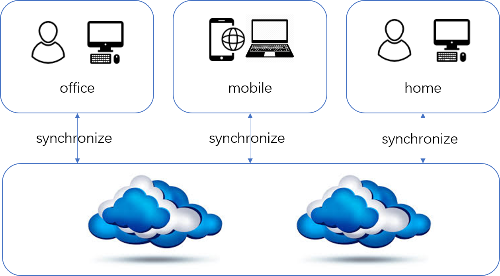

# CloudSync

CloudSync is a synchronization tool that help you sync files between local storage and cloud object storage.

This project achieves two-way synchronization.
It can synchronize files from local to cloud, or from cloud to local.
Therefore, it is able to sync user data for different sources by leveraging the cloud storage as a mediator.



CloudSync now supports Alibaba OSS and Tencent COS.
In theory, it can support any object storage that implements standard read-write APIs.

Python3 is used for development.

## Installation

1. Install requirements

    CloudSync installation requires [Python3](https://www.python.org/) and [pip](https://pypi.org/project/pip/).

    Please install them before installation.

2. Clone the code.

    Use git to clone source code of this project to the local.

    ```bash
    git clone https://github.com/szu-security-group/CloudSync.git
    ```

3. Install dependencies

    Run the following commands to install dependencies required by ClouSync.

    ```bash
    cd Cloudsync/
    pip install -r cloudsync/requirements.txt
    ```

## Usage

For the first run, you need to rename `cloudsync/cos_config.example.py` to `cloudsync/cos_config.py`.
Then fill in the contents of this file with your personal paths and keys.

`cloudsync/cos_config.py` has two dictionaries. If you use OSS as cloud object storage, please modify the dictionary named `ali`. Instead, the dictionary named `tencent` should be modify.

After filling in the configuration file, run the following command to start synchronization.

```bash
python3 cloudsync/cloudsync.py -s <ali|tencent>
```

## Contributing

Please feel free to hack on CloudSync! We're happy to accept contributions.
